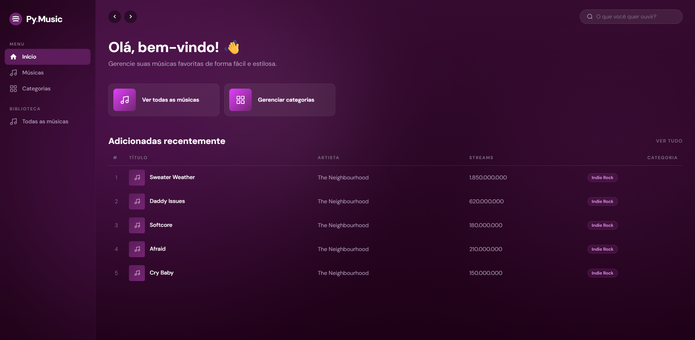
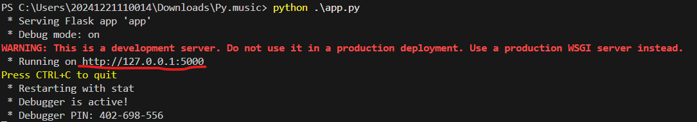

# Py.music

O Py.music é um projeto inspirado no aplicativo Spotify, mas apenas utilizando bibliotecas como Flask, e Psycopg em parte de su estrutura!

# Como usar?

+ Em primeiro lugar, baixe o código e extraia em um diretório de sua preferência em sua máquina;
+ Após isso, execute o Arquivo "Banco-Py-music(update).sql" em seu PgAdmin (OBS: O seu PgAdmin deve ser correspondente com a versão que é específicada no arquivo de backup, e você deve alterar para a senha correspondente a senha que você colocou em seu PgAdmin);
+ No Visual Studio Code, execute o arquivo com nome de "app.py" e se redirecione para a url específicada.
  

***Agora é só curtir a plataforma!***

## Download

https://github.com/vnicolas-stack/Py.music
